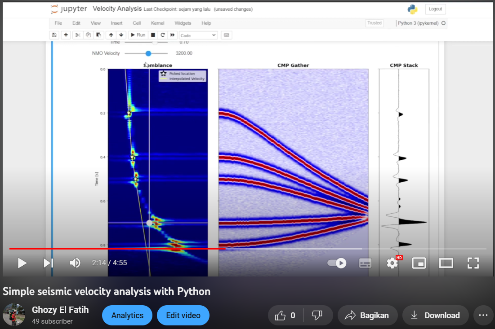

# Simple Interactive Velocity Analysis

Simple visualization of seismic velocity analysis with python

Sharing part of my course "Geophysics I: Theory of Geophysical Prospection Methods" in M.Sc. Applied Geoscience, RWTH Aachen University by Prof. Dr.sc. Florian Wagner

### Packages required
- NumPy
- Matplotlib
- SciPy
- ipywidgets
- IPython

Let's play around with the velocity!
